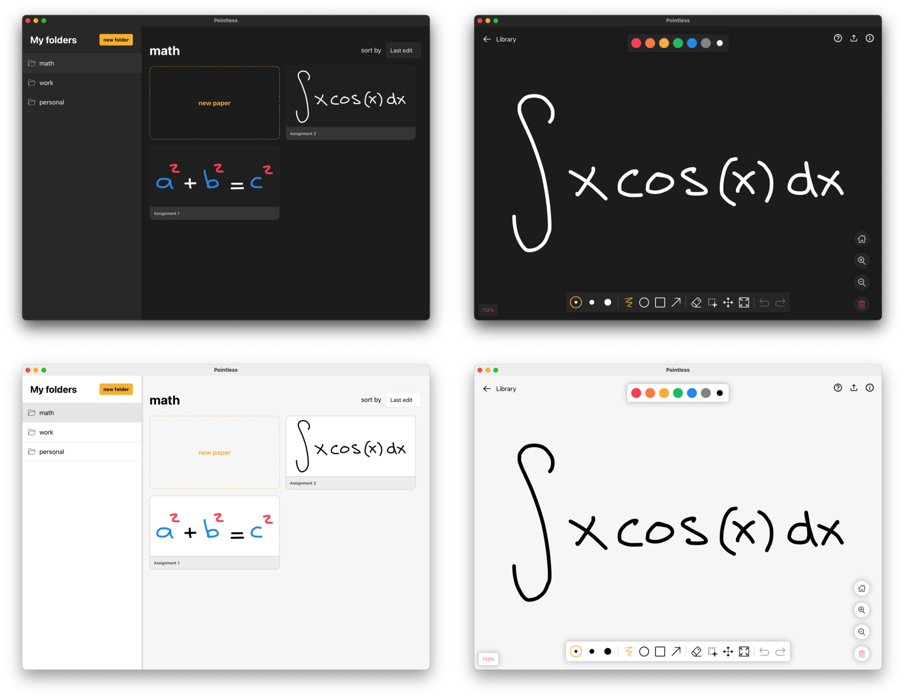
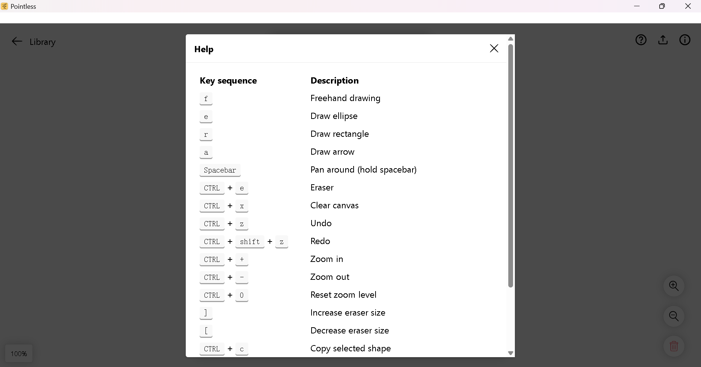

# Introduction

DraftMaster is an endless drawing canvas that provides useful features when you're
in need for a simple whiteboard/note app.

It is build using Tauri (Rust) and React with a pure SVG canvas and local files
are saved with brotli-unicode compression to ensure small file sizes.

:handshake: Feel like contributing? Submit an issue with your ideas (or bugs) and
we'll discuss it.

# Features

- [x] Export individual papers
  - [x] PNG
  - [x] JPEG
  - [x] SVG
- [ ] Toolbar
  - [x] Undo
  - [x] Redo
  - [x] Pan
  - [x] Clear
  - [x] Zoom in
  - [x] Zoom out
  - [x] Scale to fit
  - [x] Create arrow shapes
  - [x] Create rectangle shapes
  - [x] Create ellipse shapes
  - [x] Selection
    - [x] Move selected shapes
    - [x] Change color of selected shapes
    - [x] Copy/paste selected shapes
  - [ ] Text
- [x] Create folders
- [x] Local file state persistence
- [x] Light/dark theme
- [x] Basic touch support

# Development

Starting the development server can be done with `yarn run tauri dev`

# Creating a build

Creating a build can simply be done with `yarn run tauri build`
